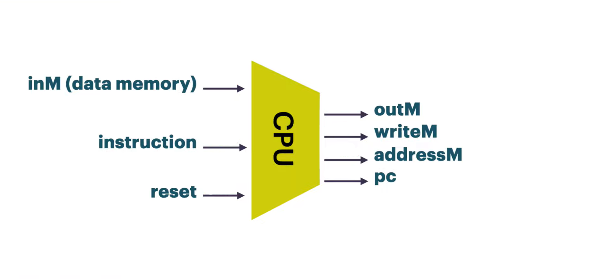

# Nand2Tetris Verilog Implementation

My attempt at a Verilog-based hardware implementation of the Nand2Tetris 16-bit Hack CPU project, starting from basic digital components building up to the final CPU.

## 📐 Architecture Overview
  - A 16-bit ALU design supporting 3-bit Operation Code Decoding (000-100), implementing AND, OR, XOR, NOR, and ADD/SUB logic. This ALU is built as a chain of 16 one-bit ALU modules: 

  | ALU Operation | OpCode |
  |---------------|--------|
  | AND           | 000    |
  | OR            | 001    |
  | XOR           | 010    |
  | NOR           | 011    |
  | ADD / SUB     | 100    |
  
  Making the final ALU circuit module: 
  - Top-level CPU integrating the ALU module, A and D registers, and a Program Counter, Overall roughly having the following architectural diagram:  
